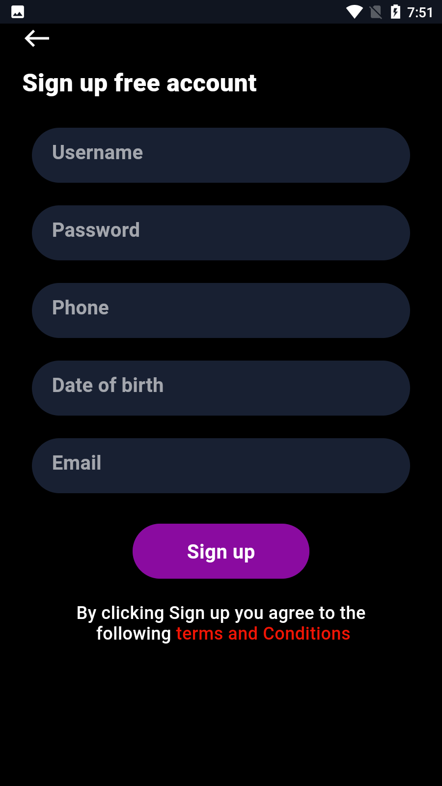
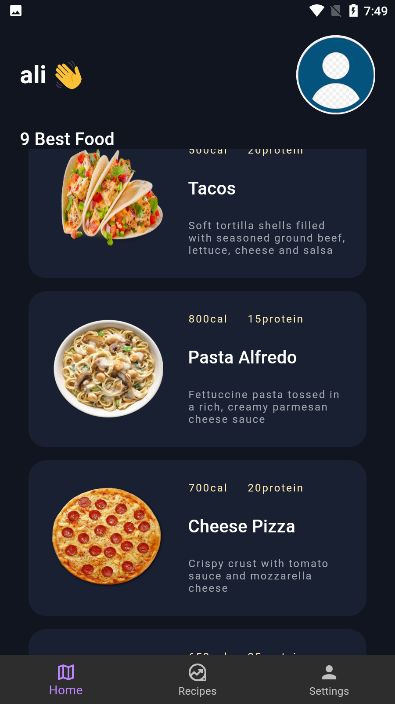

  <h1>
    Food Diary - Personal Food & Nutrition Tracker
  </h1>
  <h3>A Modern App for Tracking Your Daily Food Intake and Nutrition Goals</h3>

## 📸 Banner

    

    
    
    

## 📸 Screenshots

### Welcome & Authentication

<table border="1">
  <tr>
    <td align="center">
      
      
<b>Login Screen</b>

    </td>
    <td align="center">
      
      
<b>Sign Up Screen</b>

    </td>
    <td align="center">
      
      
<b>Profile Update</b>

    </td>
  </tr>
</table>

### Main Features

<table border="1">
  <tr>
    <td align="center">
      
      
<b>Home Dashboard</b>

    </td>
    <td align="center">
      
      
<b>Food Overview</b>

    </td>
    <td align="center">
      
      
<b>Food Details</b>

    </td>
  </tr>
  <tr>
    <td align="center">
      
      
<b>Add New Food</b>

    </td>
    <td align="center">
      
      
<b>Food Data Entry</b>

    </td>
    <td align="center">
      
      
<b>Settings</b>

    </td>
  </tr>
</table>

### Food Tracking & History

<table border="1">
  <tr>
    <td align="center">
      
      
<b>Eaten Food List</b>

    </td>
    <td align="center">
      
      
<b>Food History</b>

    </td>
    <td align="center">
      
      
<b>Meal Details</b>

    </td>
  </tr>
</table>

## 📱 Features

- **Food Tracking**: Log your daily food intake and meals
- **Modern UI**: Beautiful, intuitive interface with smooth transitions
- **Authentication**: Secure login and signup system
- **User Profiles**: Manage your personal profile and preferences
- **Nutrition Details**: View comprehensive nutritional information
- **History Tracking**: Monitor your eating habits over time
- **Data Persistence**: Store all your food data locally using SQLite

## 🚀 Tech Stack

- **Flutter** (UI Framework)
- **GetX** (State Management)
- **SQLite** (Local Database)
- **Shared Preferences** (Local Storage)
- **Material Design 3**
- **Custom Animations**

## 🔑 Key Features

- ✅ **Food Logging**: Track your daily food intake
- ✅ **Nutrition Tracking**: Monitor nutritional values
- ✅ **Meal History**: View your eating history
- ✅ **Profile Management**: Customize your user profile
- ✅ **Beautiful UI**: Modern and intuitive interface
- ✅ **Offline Access**: Access your data without internet
- ✅ **Image Support**: Add food images for better tracking

## 📖 How to Use

1. **Track Your Meals**
   - Add foods to your daily log
   - Record portion sizes
   - Track nutritional information

2. **Monitor History**
   - View past meals
   - Track eating patterns
   - Analyze nutrition intake

3. **Manage Profile**
   - Update personal information
   - Set preferences
   - Customize settings

4. **View Statistics**
   - See daily summaries
   - Track nutritional goals
   - Monitor progress
